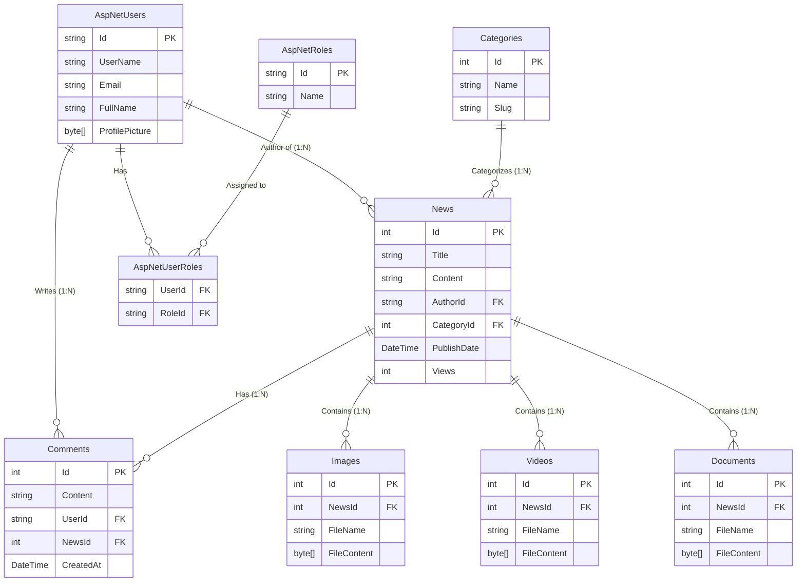

# 📊 مخطط قاعدة البيانات والعلاقات (ERD) - نظام الأخبار

يقدم هذا الملف توثيقاً مرئياً ومكتوباً لهيكل قاعدة البيانات (Database Schema) وجميع العلاقات (Relationships) بين الجداول في مشروع الموقع الإخباري.

---

## 1️⃣ مخطط الكيانات والعلاقات (ERD Diagram)

المخطط التالي يوضح ارتباط الجداول ببعضها البعض. 
*(ملاحظة: إذا كنت تعرض هذا الملف على GitHub أو محرر يدعم Mermaid، فسيتم رسم المخطط تلقائياً).*

---

## 2️⃣ شرح العلاقات بين الجداول (Relationships)

### 🔗 أ) علاقات "واحد إلى متعدد" (One-to-Many / 1:N)

1. **المستخدم (AspNetUsers) ⟷ الأخبار (News)**
   * **الشرح:** المستخدم الواحد (الكاتب/Author) يمكنه كتابة *عدة* أخبار، لكن الخبر الواحد يعود لكاتب *واحد* فقط.
   * **مفتاح الربط:** عمود `AuthorId` في جدول `News` يؤشر إلى `Id` في جدول `AspNetUsers`.

2. **الفئة (Categories) ⟷ الأخبار (News)**
   * **الشرح:** الفئة الواحدة (مثل "رياضة") يمكن أن تحتوي على *عدة* أخبار، لكن الخبر الواحد ينتمي لفئة *واحدة* فقط.
   * **مفتاح الربط:** عمود `CategoryId` في جدول `News` يؤشر إلى `Id` في جدول `Categories`.

3. **الخبر (News) ⟷ التعليقات (Comments)**
   * **الشرح:** الخبر الواحد يمكن أن يحتوي على *عدة* تعليقات. التعليق يتبع لخبر *واحد* فقط.
   * **مفتاح الربط:** عمود `NewsId` في جدول `Comments` يؤشر إلى `Id` في جدول `News`.

4. **المستخدم (AspNetUsers) ⟷ التعليقات (Comments)**
   * **الشرح:** المستخدم الواحد يمكنه كتابة *عدة* تعليقات، لكن التعليق الواحد يكتبه مستخدم *واحد* فقط.
   * **مفتاح الربط:** عمود `UserId` في جدول `Comments` يؤشر إلى `Id` في جدول `AspNetUsers`.

5. **الخبر (News) ⟷ المرفقات (Images, Videos, Documents)**
   * **الشرح:** الخبر الواحد يمكن أن يحتوي على *عدة* صور، فيديوهات، ومستندات.
   * **مفتاح الربط:** عمود `NewsId` في جداول المرفقات يؤشر إلى `Id` في جدول `News`.

### 🔗 ب) علاقات "متعدد إلى متعدد" (Many-to-Many / M:N)

1. **المستخدمين (AspNetUsers) ⟷ الأدوار (AspNetRoles)**
   * **الشرح:** المستخدم الواحد يمكن أن يمتلك *عدة* أدوار (مثل Admin و Author معاً)، والدور الواحد يمكن أن يُعطى لـ *عدة* مستخدمين.
   * **كيفية الربط:** يتم كسر هذه العلاقة عبر جدول وسيط (Junction Table) وهو **`AspNetUserRoles`**.
   * **مفاتيح الربط:**
     * `UserId` يؤشر إلى جدول المستخدمين.
     * `RoleId` يؤشر إلى جدول الأدوار.

---

## 3️⃣ هيكل الجداول الرئيسية (Database Schema)

### 🧑‍💻 جدول المستخدمين (`AspNetUsers`)
| العمود (Column) | النوع (Type) | الوصف |
|---|---|---|
| `Id` | nvarchar(450) | المفتاح الأساسي (PK). |
| `UserName` | nvarchar(256) | اسم المستخدم. |
| `Email` | nvarchar(256) | البريد الإلكتروني. |
| `FullName` | nvarchar(max) | الاسم الكامل (إضافة مخصصة). |
| `ProfilePicture`| varbinary(max)| بيانات الصورة الشخصية (إضافة مخصصة). |
| `PasswordHash` | nvarchar(max) | كلمة المرور المشفرة. |

### 📰 جدول الأخبار (`News`)
| العمود (Column) | النوع (Type) | الوصف |
|---|---|---|
| `Id` | int | المفتاح الأساسي (PK). زيادة تلقائية. |
| `Title` | nvarchar(max) | عنوان الخبر. |
| `Content` | nvarchar(max) | محتوى الخبر (HTML/Text). |
| `AuthorId` | nvarchar(450) | المفتاح الأجنبي (FK) لكاتب الخبر. |
| `CategoryId` | int | المفتاح الأجنبي (FK) لفئة الخبر. |
| `PublishDate` | datetime2 | تاريخ النشر. |
| `Views` | int | عدد المشاهدات. |
| `Likes` | int | عدد الإعجابات. |

### 🗂️ جدول الفئات (`Categories`)
| العمود (Column) | النوع (Type) | الوصف |
|---|---|---|
| `Id` | int | المفتاح الأساسي (PK). |
| `Name` | nvarchar(max) | اسم الفئة (مثال: رياضة، سياسة). |
| `Slug` | nvarchar(max) | الاسم اللطيف للرابط (مثال: sports). |

### 💬 جدول التعليقات (`Comments`)
| العمود (Column) | النوع (Type) | الوصف |
|---|---|---|
| `Id` | int | المفتاح الأساسي (PK). |
| `NewsId` | int | المفتاح الأجنبي (FK) للخبر المرتبط. |
| `UserId` | nvarchar(450) | المفتاح الأجنبي (FK) لصاحب التعليق. |
| `Content` | nvarchar(max) | نص التعليق. |
| `CreatedAt` | datetime2 | تاريخ كتابة التعليق. |

### 📎 جداول المرفقات (`Images`, `Videos`, `Documents`)
*(هذه الجداول تمتلك نفس الهيكل تقريباً مع اختلاف نوع المحتوى)*

| العمود (Column) | النوع (Type) | الوصف |
|---|---|---|
| `Id` | int | المفتاح الأساسي (PK). |
| `NewsId` | int | المفتاح الأجنبي (FK) للخبر الذي يمتلك المرفق. |
| `FileName` | nvarchar(max) | اسم الملف (مثال: document.pdf). |
| `FileContent` | varbinary(max)| البيانات الثنائية للملف المخزنة بقاعدة البيانات. |
| `FileType` | nvarchar(max) | نوع الملف (MIME Type). |
| `FileSize` | bigint | حجم الملف بالبايت. |
| `Title` | nvarchar(max) | عنوان اختياري للمرفق. |

---

## 🛡️ ملاحظات حول الحذف المتتالي (Cascade Delete)

عند العمل على الـ Entity Framework في هذا المشروع، يجب الانتباه إلى ما يلي:
- **حذف مستخدم:** إذا تم حذف مستخدم، ماذا يحدث للأخبار والتعليقات الخاصة به؟ عادة يتم منع الحذف (`Restrict`) أو تعيين المؤلف كـ `Null` للحفاظ على الأخبار، أو تطبيق `Cascade Delete` إذا كنت تريد حذف كل بياناته (يُفضل وضع إعداد `Restrict` للأخبار لتجنب فقدان المحتوى).
- **حذف خبر:** إذا تم حذف خبر، فإنه وبشكل افتراضي (`Cascade Delete`) سيتم مسح جميع التعليقات، الصور، الفيديوهات، والمستندات المرتبطة به لتنظيف قاعدة البيانات.
- **حذف فئة:** حذف فئة يجب أن يمنع (`Restrict`) إذا كان هناك أخبار بداخلها، لتجنب حدوث خلل بالأخبار اليتيمة.