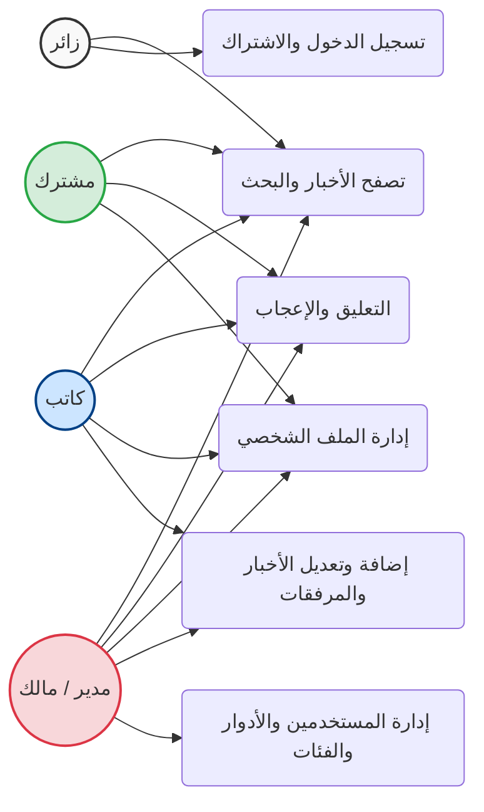
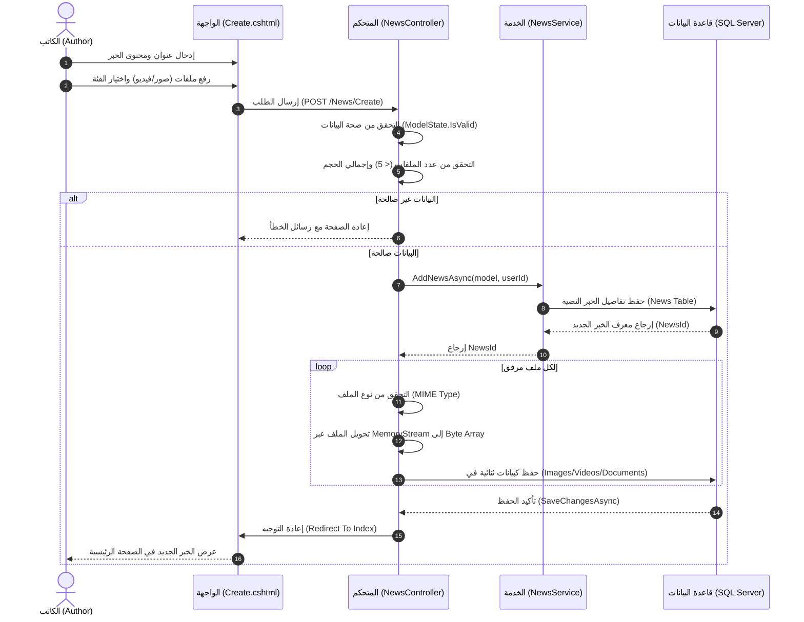

# 📐 مخططات هندسة البرمجيات ونموذج التطوير

يوثق هذا الملف منهجية التطوير المتبعة في بناء موقع الأخبار (NewsSite)، بالإضافة إلى المخططات الهندسية (UML و Architecture Diagrams) التي تصف تفاعل مكونات النظام.

---

## 1️⃣ نموذج التطوير المتبع (Development Model)

النموذج الهندسي الذي تم اعتماده في تطوير هذا النظام هو **النموذج التكراري التزايدي (Iterative and Incremental Model)** المنسجم مع مبادئ **Agile**.

### 💡 لماذا هذا النموذج؟
1. **التزايد (Incremental):** تم بناء النظام على شكل وحدات (Modules) متتالية. بدأنا بأساسيات تسجيل الدخول، ثم أضفنا نظام الملف الشخصي، ثم نظام الأخبار، ثم المرفقات والتعليقات.
2. **التكرار (Iterative):** قمنا بتحسين نفس الميزة عدة مرات بناءً على المتطلبات. (مثال: نظام الصور الشخصية بدأ بحفظ الملفات في المجلدات `wwwroot`، ثم في تكرار لاحق تم تعديله ليحفظ البيانات الثنائية `byte[]` في قاعدة البيانات مباشرة لتحسين الأمان وقابلية النقل).

---

## 2️⃣ البنية المعمارية للنظام (System Architecture)

يعتمد المشروع على المعمارية القياسية **MVC (Model-View-Controller)** لضمان فصل الاهتمامات (Separation of Concerns).

```mermaid
flowchart TD
    %% تعريف المكونات
    User((المستخدم))
    View["الواجهة (Views/UI)
    HTML/CSS/JS/Razor"]
    Controller["المتحكم (Controllers)
    NewsController / ProfileController"]
    Model["النماذج (Models)
    ApplicationUser / News / ViewModels"]
    DB[(قاعدة البيانات
    SQL Server)]
    Service["طبقة الخدمات (Services)
    UserService / NewsService"]

    %% الروابط
    User <-->|يتفاعل مع| View
    View -->|يرسل طلبات HTTP| Controller
    Controller -->|يمرر البيانات (ViewModel)| View
    Controller -->|يستدعي منطق العمل| Service
    Service -->|يقرأ/يكتب| Model
    Service <-->|Entity Framework Core| DB
    Controller <-->|مباشرة أحياناً| DB
```

---

## 3️⃣ مخطط حالات الاستخدام (Use Case Diagram)

يوضح هذا المخطط أنواع المستخدمين (Actors) في النظام والصلاحيات الممنوحة لكل منهم.



---

## 4️⃣ مخطط التتابع (Sequence Diagram)

يوضح المخطط التالي تسلسل العمليات عند **إضافة كاتب لخبر جديد يحتوي على مرفقات (صور/فيديوهات)**.



---

## 5️⃣ تقنيات وأدوات الهندسة المستخدمة

- **النمط المعماري:** MVC (Model-View-Controller).
- **إطار العمل:** ASP.NET Core 8.0 / 7.0.
- **الوصول للبيانات (ORM):** Entity Framework Core (Code-First Approach).
- **إدارة الهوية:** ASP.NET Core Identity (للمصادقة والتفويض).
- **تأمين البيانات:**
  - تشفير كلمات المرور (Password Hashing).
  - الحماية من هجمات CSRF باستخدام `[ValidateAntiForgeryToken]`.
  - التعقيم (Sanitization) لأسماء الملفات المرفوعة.
- **التخزين (Storage):** 
  - تخزين النصوص والبيانات الأساسية في الجداول.
  - تخزين الملفات والصور كبيانات ثنائية `varbinary(max)` (Byte Arrays) لضمان المركزية وتقليل مشاكل صلاحيات خوادم الملفات.

---
*تم توليد هذه المخططات باستخدام لغة Mermaid المتوافقة بالكامل مع مستودعات GitHub وأنظمة التوثيق الحديثة.*